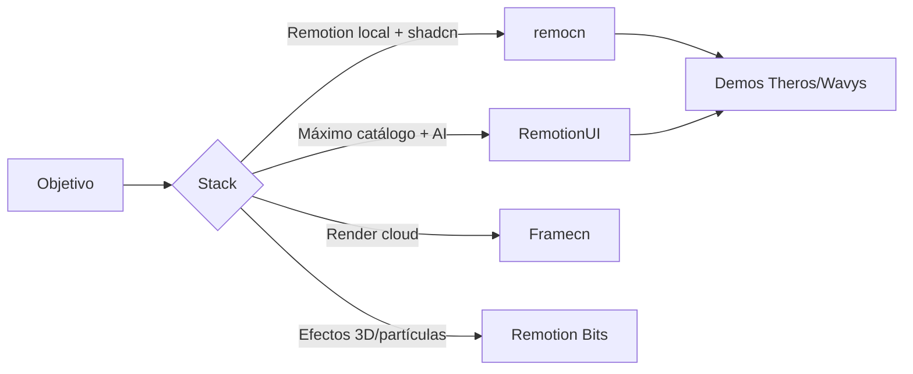

## Qué es [remocn.dev](https://www.remocn.dev/)

No es MCP remoto — es un **registry estilo shadcn para video con Remotion**: componentes React copy-paste (transiciones, text reveals, UI blocks, composiciones completas) que instalas con:

```bash
pnpm create video@latest          # proyecto Remotion
pnpm dlx shadcn@latest init
pnpm dlx shadcn@latest add remocn/typewriter
pnpm dlx remotion render
```

Filosofía clave: **el código cae en tu repo**, lo editas, no hay dependencia runtime. Ideal para demos de producto, changelogs en video, trailers de launch, contenido para X/LinkedIn.

Tiene **64+ componentes** en 5 categorías: text animations, transitions, backgrounds, UI blocks (terminal, code diff, charts, cursor simulado), y composiciones listas (`TerminalToBrowserDeploy`, `DashboardPopulate`, `Claude Code`, etc.).

---

## Similares directos (mismo concepto: shadcn + video en código)

| Tool | URL | Stack | Componentes | Instalación | Notas |
|------|-----|-------|-------------|-------------|-------|
| **remocn** | [remocn.dev](https://www.remocn.dev/) | Remotion + shadcn | 64+ | `npx shadcn add remocn/...` | El que enlazaste. Muy pulido, respaldado por shadcn. Incluye **remocn-ui** (Button, Dialog, etc. animados en timeline). |
| **RemotionUI** | [remotionui.com](https://remotionui.com) | Remotion | **108+** | `npx remotion-ui add fade-in` | El más grande. CLI propio, recipes, captions, audiogramas, mapas, `claude-code`, `v0`, social clips. **Muy AI-ready.** |
| **Framecn** | [framecn.dev](https://www.framecn.dev/) | **Editframe** + shadcn | ~similar a remocn | `npx shadcn add @framecn/...` | Mismo modelo shadcn pero sobre Editframe (render cloud). Crédita a remocn como inspiración. |
| **Remotion Bits** | [remotion-bits.dev](https://remotion-bits.dev/) | Remotion | muchos | `npx jsrepo add ... remotion-bits` | Partículas, text effects, 3D. También como npm package. Tiene **MCP server** propio. |
| **remotion-ui** (rrh1441) | GitHub | Remotion | 25+ + 70 assets | `npx remotion-ui add title-card` | Versión anterior/más pequeña del ecosistema; RemotionUI (riaz37) es la evolución grande. |

---

## Templates / toolkits complementarios

| Recurso | Para qué sirve |
|---------|----------------|
| [remotion-saas-showcase](https://github.com/s0974092/remotion-saas-showcase) | PhoneFrame, BrowserFrame, Cursor, templates mobile/desktop |
| [remotion-cinematic](https://github.com/codeverbojan/remotion-cinematic) | Template SaaS con cámara, cursor geométrico, editor visual |
| [Remotion oficial](https://www.remotion.dev/) | Base obligatoria — Player, Studio, Lambda render |
| [Editframe](https://editframe.com/) | Si quieres render cloud sin montar pipeline propio (Framecn) |

---

## Skills potentes (los que valen la pena instalar)

**En tu máquina no hay skills de Remotion/remocn todavía.** Los más útiles:

### 1. Remotion oficial (imprescindible)
```bash
npx remotion skills add
# o con bun:
bunx skills add remotion-dev/skills
```
Best practices de frames, `interpolate`, `spring`, voiceover con ElevenLabs, etc.  
Docs: [remotion.dev/docs/ai/skills](https://www.remotion.dev/docs/ai/skills)

### 2. RemotionUI (si usas ese registry)
El repo incluye skills en `skills/remotion-ui/` y archivos para agentes:
- [remotionui.com/llms.txt](https://remotionui.com/llms.txt)
- [remotionui.com/ai/recipes.json](https://remotionui.com/ai/recipes.json)
- [remotionui.com/docs/ai](https://remotionui.com/docs/ai)

Guía explícita para Cursor/Claude: instalar con CLI, importar desde paths locales, **no** usar CSS transitions para motion en video.

### 3. Framecn (skill mínimo)
Disponible en: `https://www.framecn.dev/.well-known/agent-skills/site-skill.md`

### 4. Remotion Bits
Registry + MCP para descubrir componentes: [remotion-bits.dev](https://remotion-bits.dev/)

### remocn
No tiene skill/agent index tan formal como RemotionUI todavía, pero la doc por componente es muy buena (props editables en vivo, ejemplos de `Root.tsx`).

---

## Cuál elegir para Wavys (uso intensivo)



**Recomendación práctica:**

1. **Base:** Remotion + skill oficial `remotion-dev/skills`
2. **Registry principal:** **remocn** si ya usas shadcn/ui (encaja con Theros/Wavys front)
3. **Segundo registry:** **RemotionUI** para piezas que remocn no tenga (captions, social clips, audiogramas, recipes)
4. **No mezclar** Framecn con remocn en el mismo proyecto — stacks distintos (Editframe vs Remotion puro)

Para Wavys encajan especialmente:
- `claude-code`, `terminal-simulator`, `code-diff-wipe` → demos de agente/dev tools
- `browser-flow`, `terminal-to-browser-deploy` → deploy/showcase
- `x-follow-card`, `shimmer-sweep` → contenido social
- `pricing-tier-focus`, `dashboard-populate` → SaaS marketing

---

## Quick start sugerido

```bash
# 1. Skills para que Cursor sepa hacer video bien
cd /path/to/tu-proyecto-video
bunx skills add remotion-dev/skills

# 2. Proyecto
pnpm create video@latest wavys-demos
cd wavys-demos
pnpm dlx shadcn@latest init

# 3. Primeros bloques remocn
pnpm dlx shadcn@latest add remocn/terminal-simulator remocn/browser-flow remocn/typewriter

# 4. Preview + render
pnpm dev          # Remotion Studio
pnpm remotion render src/Root.tsx MiComp out/demo.mp4
```
