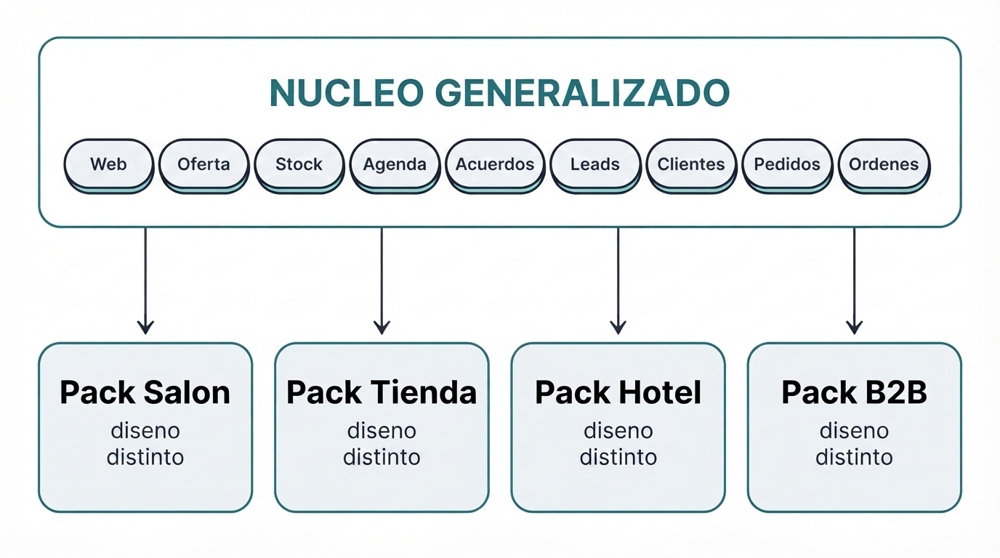
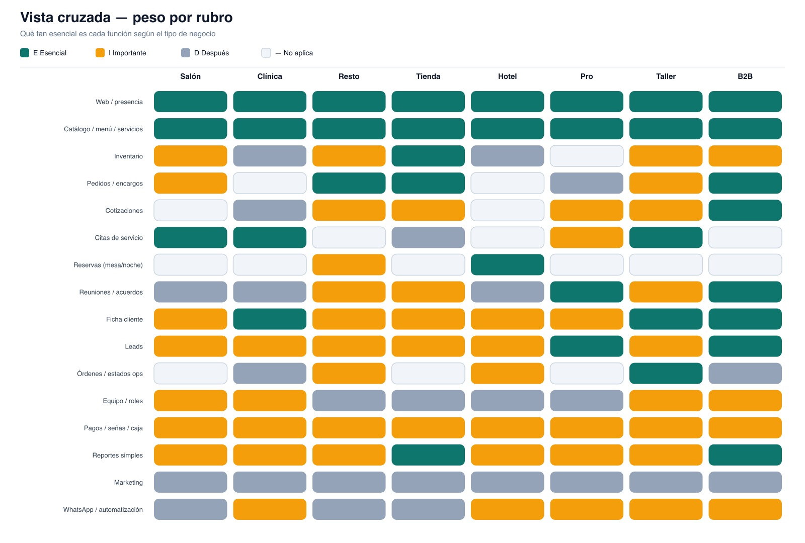

# Wavys OS — Mapa de negocios y núcleo generalizado

**Documento de producto (bases)**  
**Fecha:** 2026-07-21  
**Para:** Phil / Wavys  
**Objetivo:** Entender qué necesita cada tipo de empresa y qué partes del software se pueden reutilizar (generalizar) para luego armar un sistema distinto por rubro.

---

## 1. De qué trata este documento

Imagina que Wavys ofrece un **sistema operativo para la PYME**: cada empresa entra, describe su negocio, obtiene su website y enciende las herramientas que le sirven (catálogo, stock, citas, pedidos, etc.).

Hay dos capas que hay que pensar juntas:

| Capa | Pregunta que responde | Analogía |
|------|----------------------|----------|
| **Por negocio** | ¿Qué necesita un salón, una tienda, un hotel…? | El “traje” a medida |
| **General** | ¿Qué piezas se repiten y se pueden construir una sola vez? | La “tela y los botones” compartidos |

**Regla de oro:** no hacemos 8 softwares desde cero. Hacemos **bloques generales** y con ellos **creamos la experiencia de cada negocio** (diseño, nombres y flujos distintos).

---

## 2. Cómo leer las prioridades

En las tablas de cada negocio verás:

| Código | Significado |
|--------|-------------|
| **E** | Esencial — sin esto el negocio digital no arranca bien |
| **I** | Importante — lo usa seguido; sube mucho el valor |
| **D** | Después — útil, pero no día 1 |
| **—** | Casi no aplica a ese rubro |

---

## 3. Dos conceptos que no se deben mezclar

Antes de listar todo, una claridad importante:

| Concepto | Ejemplo | Qué es | Qué hace el software |
|----------|---------|--------|----------------------|
| **Cita / reserva de servicio** | Cliente agenda un corte a las 4pm | Tiempo + servicio (+ profesional) | Calendario, huecos, confirmación |
| **Reunión de acuerdo** | Dueño se reúne con un proveedor o cliente B2B para cotizar/cerrar | Conversación comercial + memoria | Notas, acuerdos, próximo paso |

Un salón vive de **citas**. Un mayorista vive de **acuerdos**. Algunos negocios necesitan ambos; muchos solo uno. En el núcleo general son **dos bloques distintos** (Agenda vs Acuerdos).

---

## 4. Capa general — Bloques reutilizables

Estos bloques se construyen **una vez**. Cada negocio los enciende o no, y los **renombra / diseña** a su manera.

### 4.1 Lista de bloques

| Bloque general | Qué hace (en abstracto) | Ejemplos de cómo se ve en un negocio |
|----------------|-------------------------|--------------------------------------|
| **Presencia web** | Sitio público, marca, CTA, dominio, WhatsApp visible | Landing del salón, catálogo de la tienda, web del hotel |
| **Oferta (items)** | Cosas que se venden: precio, foto, categoría, atributos | Producto, plato, servicio, habitación |
| **Inventario** | Cantidades, entradas/salidas, alertas de stock bajo | Stock de ropa, insumos de cocina, repuestos |
| **Agenda** | Espacios de tiempo + un recurso (persona, mesa, habitación) | Cita con estilista, turno médico, noche de hotel |
| **Acuerdos** | Memoria comercial: qué se habló y qué sigue | Visita a cliente B2B, catering, propuesta de abogado |
| **Leads** | Quién escribió / preguntó y en qué estado está | Formulario web, “me interesa”, pedir cita |
| **Clientes** | Ficha + historial mínimo | Paciente, huésped, cuenta empresa, cliente frecuente |
| **Pedidos** | Solicitud estructurada con estados | Encargo de torta, pedido WhatsApp, cotización→pedido |
| **Órdenes operativas** | Flujo interno con estados | Orden de taller, pedido en cocina, housekeeping |
| **Equipo** | Usuarios, roles, asignación | Estilistas, técnicos, vendedores |
| **Dinero** | Señas, pagos, caja del día, reportes simples | Anticipo de cita, seña de reserva, reporte de ventas |
| **Marketing / automatización** | Promos, recordatorios, WhatsApp IA | “Tu cita es mañana”, reactivar lead (fase posterior) |

### 4.2 Por qué generalizar

- Evita reescribir 8 veces “lista de cosas con precio y foto”.
- Permite que el **prompt** diga: “eres un salón” → carga Agenda + Oferta(servicios) + Clientes, con labels de salón.
- Más adelante, un módulo nuevo (ej. reportes) beneficia a todos los packs.

### 4.3 Diagrama mental

Un solo núcleo compartido; cada pack (Salón, Tienda, Hotel, B2B, …) lo usa con diseño y vocabulario distintos.



*Archivo de la imagen:* `data/wavys-os-brief/assets/diagrama-nucleo-packs.jpg` (Gemini `gemini-3.1-flash-lite-image`)

### 4.4 Mismo bloque, diseño distinto (ejemplos)

| Bloque | En tienda | En restaurante | En salón | En hotel |
|--------|-----------|----------------|----------|----------|
| Oferta | Productos + talla/color | Platos del menú | Servicios + duración | Tipos de habitación |
| Agenda | Casi no / asesoría | Reserva de mesa | Cita + estilista | Reserva por noche |
| Pedidos | Encargo / WhatsApp | Delivery / encargo | Venta de producto | Reserva con seña |
| Órdenes | — | Estados de cocina | — | Check-in / limpieza |
| Acuerdos | Si vende a mayoristas | Catering / eventos | Poco | Poco |

---

## 5. Capa por negocio — Necesidades de cada uno

Abajo: qué vende, cómo trabaja, dolores, y **qué software le sirve** (con prioridad). Al final de cada rubro: qué bloques del núcleo usa y cómo se “viste”.

---

### 5.1 Salón de belleza / barbería / spa

**Qué vende:** tiempo + servicio (corte, color, etc.); a veces productos (shampoo).  
**Cómo trabaja:** agenda del día, varios profesionales, clientes que vuelven.  
**Dolores típicos:** doble reserva, clientes que no llegan, WhatsApp desordenado para agendar, web sin precios claros.

| Área | Función de software | Prioridad |
|------|---------------------|-----------|
| Presencia | Web de servicios, galería, WhatsApp, ubicación | E |
| Oferta | Lista de servicios (duración, precio, profesional) | E |
| Agenda | Calendario por profesional, huecos, confirmación | E |
| Clientes | Ficha (preferencias, última visita, notas) | I |
| Venta | Venta de productos retail + ticket simple | I |
| Stock | Insumos / productos de venta | I |
| Equipo | Profesionales, horarios, comisiones | I |
| Dinero | Señas / pagos de cita, caja del día | I |
| Leads | Formulario o “reservar” desde la web | I |
| Marketing | Recordatorio de retorno, promos, reseñas | D |
| Automatización | Recordatorio WhatsApp de la cita | D |

**Bloques del núcleo que usa:** Presencia, Oferta(servicios), Agenda, Clientes, Leads, Dinero; Oferta+Stock retail (I); Equipo (I).  
**Casi no necesita:** reuniones B2B formales, inventario mayorista, órdenes de taller.

**Pack Salón — cómo se siente:** vocabulario *servicio, estilista, cita*; web con galería y “Reservar”.

---

### 5.2 Clínica / consultorio (dental, estética, veterinaria)

**Qué vende:** consultas y tratamientos.  
**Cómo trabaja:** turnos por profesional o box, seguimiento del paciente.  
**Dolores:** agenda llena, no-shows, consultas por WhatsApp sin orden, poca presencia digital seria.

| Área | Función de software | Prioridad |
|------|---------------------|-----------|
| Presencia | Web profesional, servicios, CTA cita/WhatsApp | E |
| Oferta | Tratamientos / paquetes | E |
| Agenda | Citas por profesional/box + estados (confirmó/asistió) | E |
| Clientes | Ficha paciente + historial de visitas | E |
| Leads | Solicitudes de cita desde la web | I |
| Dinero | Pagos, paquetes, saldo pendiente (simple) | I |
| Equipo | Varios profesionales / agendas | I |
| Automatización | Recordatorios y reconfirmación | I |
| Stock | Insumos clínicos | D |
| Operaciones | Plan de tratamiento por etapas | D |
| Acuerdos | Convenios con empresas (ej. flotas en vet) | D |
| Marketing | Campañas de chequeo, reseñas | D |

**Bloques del núcleo:** Presencia, Oferta, Agenda, Clientes, Leads, Dinero, Automatización.  
**No es (día 1):** historia clínica hospitalaria completa.

**Pack Clínica:** vocabulario *consulta, paciente, turno*; web de confianza + pedir cita.

---

### 5.3 Restaurante / cafetería / pastelería

**Qué vende:** comida y bebida; a veces encargos y catering.  
**Cómo trabaja:** carta, pedidos, cocina, stock de insumos o productos listos (tortas).  
**Dolores:** carta desactualizada, fotos en el celular, no saben qué se agotó, pedidos por chat sin control, catering sin seguimiento.

| Área | Función de software | Prioridad |
|------|---------------------|-----------|
| Presencia | Web, fotos, horarios, ubicación, WhatsApp | E |
| Oferta | Menú/carta vivo (categorías, precios, “agotado”) | E |
| Pedidos | Encargos / delivery estructurado | E |
| Stock | Agotados, porciones, insumos críticos | I |
| Operaciones | Estados: recibido → preparando → listo | I |
| Agenda | Reserva de mesa (si aplica) | I |
| Acuerdos | Catering / eventos (fecha, monto, avances) | I |
| Clientes | Frecuentes / empresas de catering | I |
| Leads | Contacto y pedidos desde link | I |
| Dinero | Señas de encargos, reporte de pedidos | I |
| Equipo | Roles cocina / atención | D |
| Marketing | Promo del día, link de menú | D |
| Automatización | Aviso “pedido listo” | D |

**Bloques del núcleo:** Presencia, Oferta(menú), Pedidos, Stock, Órdenes(cocina), Leads, Dinero; Agenda(mesa) y Acuerdos(catering) si aplica.

**Pack Resto:** vocabulario *plato, carta, encargo, agotado*; web = menú vivo.

---

### 5.4 Tienda / boutique / comercio

**Qué vende:** productos físicos (a menudo con variantes: talla, color).  
**Cómo trabaja:** stock, catálogo compartible, venta en local + WhatsApp.  
**Dolores:** Excel eterno, fotos sueltas, no hay link de catálogo, “no sé si hay stock”.

| Área | Función de software | Prioridad |
|------|---------------------|-----------|
| Presencia | Web / catálogo online con link | E |
| Oferta | Productos, fotos, precios, categorías, variantes | E |
| Stock | Entradas/salidas, stock bajo, conteo | E |
| Pedidos | Encargos / lista de pedidos | E |
| Leads | “Me interesa” desde el catálogo | I |
| Clientes | Recurrentes / mayoristas | I |
| Acuerdos | Tratos con mayoristas o empresas | I |
| Dinero | Pagos parciales, reporte de ventas | E/I |
| Equipo | Vendedores, sedes | D |
| Marketing | Cupones, lanzamientos | D |
| Agenda | Cita de asesoría / prueba (si aplica) | D |
| Automatización | “Llegó stock”, seguimiento de lead | D |

**Bloques del núcleo:** Presencia, Oferta(productos), Stock, Pedidos, Leads, Clientes, Dinero; Acuerdos si mayorista.

**Pack Tienda:** vocabulario *producto, talla, stock, pedido*; web = catálogo compartible.

---

### 5.5 Hotel / hostal / alojamiento

**Qué vende:** noches + habitaciones (+ extras).  
**Cómo trabaja:** ocupación, reservas, check-in/out.  
**Dolores:** reservas solo por WhatsApp, web floja, no se ve disponibilidad real.

| Área | Función de software | Prioridad |
|------|---------------------|-----------|
| Presencia | Web con habitaciones, fotos, ubicación, WhatsApp | E |
| Oferta | Tipos de habitación, tarifas, extras | E |
| Agenda | Calendario de ocupación / reservas por noche | E |
| Pedidos / reserva | Reserva con seña, canal directo | E |
| Clientes | Huéspedes, historial de estadías | I |
| Dinero | Señas, saldos, reporte de ocupación | I |
| Operaciones | Check-in/out, housekeeping (estados) | I |
| Leads | Consultas de disponibilidad | I |
| Automatización | Confirmación y mensaje pre-llegada | I |
| Equipo | Recepción / roles | D |
| Marketing | Temporadas, paquetes | D |
| Stock | Amenities / minibar | D |

**Nota:** la “reserva hotelera” usa el bloque **Agenda**, pero la unidad es **noche/habitación**, no “30 minutos de servicio”.

**Pack Hotel:** vocabulario *habitación, noche, ocupación, check-in*.

---

### 5.6 Profesional / estudio (abogado, contador, coach, fotógrafo)

**Qué vende:** expertise, proyectos, sesiones.  
**Cómo trabaja:** credibilidad online, consultas, propuestas, cierres.  
**Dolores:** verse poco serio online, citas desordenadas, olvidar qué se acordó en una llamada.

| Área | Función de software | Prioridad |
|------|---------------------|-----------|
| Presencia | Web/portfolio, bio, casos, contacto | E |
| Oferta | Servicios / paquetes / tarifas (si publica) | E |
| Leads | Formulario, bandeja, origen | E |
| Acuerdos | Reuniones, alcance, honorarios, próximos pasos | E |
| Agenda | Citas de consulta / sesión | I |
| Clientes | Ficha + historial de trabajos | I |
| Pedidos | Propuestas / cotizaciones simples | I |
| Dinero | Pagos por hito / anticipos | I |
| Automatización | Seguimiento de leads sin respuesta | I |
| Equipo | Colaboradores | D |
| Marketing | Contenido / newsletter | D |
| Stock | Casi no aplica | — |

**Pack Profesional:** vocabulario *sesión, propuesta, acuerdo, honorarios*; web = portfolio + contacto.

---

### 5.7 Taller / servicio técnico (autos, equipos, mantenimiento)

**Qué vende:** diagnóstico + reparación (+ repuestos).  
**Cómo trabaja:** recepción, órdenes de trabajo, estados, entrega.  
**Dolores:** “¿ya está listo?”, piezas sin control, citas de recepción chocadas.

| Área | Función de software | Prioridad |
|------|---------------------|-----------|
| Presencia | Web de servicios, confianza, WhatsApp | E |
| Oferta | Servicios / mantenimientos | E |
| Agenda | Cita de recepción / diagnóstico | E |
| Órdenes | OT + estados (recibido → en proceso → listo) | E |
| Clientes | Cliente + activo (auto/equipo) + historial | E |
| Stock | Repuestos | I |
| Pedidos | Cotización de reparación → aprobación | I |
| Dinero | Anticipos, saldo al retirar | I |
| Leads | Solicitudes de servicio | I |
| Acuerdos | Contratos con flotas / empresas | I |
| Equipo | Técnicos, asignación de OT | I |
| Automatización | Aviso “listo para recoger” | I |
| Marketing | Recordatorio de mantenimiento | D |

**Pack Taller:** vocabulario *orden, diagnóstico, listo para recoger*.

---

### 5.8 B2B / proveedor / mayorista

**Qué vende:** volumen, condiciones, relación comercial larga.  
**Cómo trabaja:** visitas, cotizaciones, seguimiento.  
**Dolores:** promesas en el aire, sin historial de lo hablado, catálogo en PDF eterno.

| Área | Función de software | Prioridad |
|------|---------------------|-----------|
| Presencia | Web corporativa / catálogo | E |
| Oferta | Lista de productos + precios (o por lista) | E |
| Acuerdos | Visitas, notas, compromisos, pipeline | E |
| Leads | Captura y calificación | E |
| Clientes | Cuentas, contactos, historial | E |
| Pedidos | Cotizaciones → pedidos | E |
| Stock | Disponibilidad / lead time | I |
| Dinero | Condiciones de pago, estados de pedido | I |
| Equipo | Vendedores, territorio | I |
| Agenda | Visitas programadas (no “cita de salón”) | I |
| Automatización | Seguimiento de cotización / reactivación | I |
| Marketing | Fichas técnicas, lanzamientos | D |

**Pack B2B:** vocabulario *cuenta, visita, cotización, pipeline*.

---

## 6. Vista cruzada — Qué peso tiene cada función por rubro

Colores en lugar de letras: **teal = Esencial (E)** · **ámbar = Importante (I)** · **gris = Después (D)** · **claro = No aplica (—)**.



*Archivo:* `data/wavys-os-brief/assets/vista-cruzada-heatmap.jpg`  
*(También hay SVG editable: `assets/vista-cruzada-heatmap.svg`)*

| Función | Salón | Clínica | Resto | Tienda | Hotel | Pro | Taller | B2B |
|---------|-------|---------|-------|--------|-------|-----|--------|-----|
| Web / presencia | E | E | E | E | E | E | E | E |
| Catálogo / menú / servicios | E | E | E | E | E | E | E | E |
| Inventario | I | D | I | E | D | — | I | I |
| Pedidos / encargos | I | — | E | E | — | D | I | E |
| Cotizaciones | — | D | I | I | — | I | I | E |
| Citas de servicio | E | E | — | D | — | I | E | — |
| Reservas (mesa/noche) | — | — | I | — | E | — | — | — |
| Reuniones / acuerdos | D | D | I | I | D | E | I | E |
| Ficha cliente | I | E | I | I | I | I | E | E |
| Leads | I | I | I | I | I | E | I | E |
| Órdenes / estados ops | — | D | I | — | I | — | E | D |
| Equipo / roles | I | I | D | D | D | D | I | I |
| Pagos / señas / caja | I | I | I | I | I | I | I | I |
| Reportes simples | I | I | I | E | I | I | I | E |
| Marketing | D | D | D | D | D | D | D | D |
| WhatsApp / automatización | D | I | D | D | I | I | I | I |

---

## 7. Tres “familias” de operación (para no mezclar)

Al diseñar el sistema, conviene pensar en tres familias. Un pack combina una o más:

1. **Agenda de servicio** → salón, clínica, taller, profesional  
2. **Catálogo + stock + pedidos** → tienda, resto, B2B  
3. **Acuerdos / pipeline** → B2B, profesional, catering, mayorista  

**Reservas de espacio** (hotel, mesa) son primas de Agenda, con otra unidad (noche / mesa).

---

## 8. Cómo se usa esto al crear el sistema

### Paso 1 — Construir el núcleo (general)
Implementar los bloques de la sección 4 con un modelo de datos común (`tenantId`, items, slots, etc.).

### Paso 2 — Crear cada pack (por negocio)
Para cada rubro de la sección 5:
- Elegir bloques
- Renombrar pantallas y campos
- Diseñar plantilla web del rubro
- Definir onboarding (qué pregunta el prompt)

### Paso 3 — Prompt de onboarding
1. El usuario describe el negocio.  
2. El sistema detecta el rubro (ej. “salón”).  
3. Carga el **Pack Salón**.  
4. Genera preview de web + activa funciones E (y sugiere las I).  
5. El usuario confirma / ajusta.

**No es** un dashboard genérico con 50 menús.  
**Sí es** ocho experiencias verticales sobre el mismo motor.

---

## 9. Relación con lo que Wavys ya vende

| Hoy | Mañana (Wavys OS) |
|-----|-------------------|
| **Presencia Digital** — Wavys entrega la web a mano | El cliente (o Wavys) genera presencia + operación desde el panel |
| **Quoter / ReActiva / 24/7** — CRM conversacional WhatsApp | Se conectan al mismo tenant como capa de automatización |
| Pipelines `one_call_landing` / `one_call_website` | Motor interno para generar sites por pack |

---

## 10. Cómo se crea cada parte (regla de producto)

Hay **tres modos distintos**. No todo lo genera la IA igual.

```text
┌─────────────────────────────┐
│ 1. WEBSITE                  │  → IA al 100% (skill ya existente)
│    Landing / sitio público  │     one_call_landing / one_call_website
└─────────────────────────────┘

┌─────────────────────────────┐
│ 2. OFERTA                   │  → Base de datos estructurada
│    Catálogo / Menú /        │     (volumen + características distintas)
│    Servicios / Habitaciones │     La IA puede ayudar a cargar/sugerir,
└─────────────────────────────┘     pero el sistema es de datos, no “solo diseño”

┌─────────────────────────────┐
│ 3. RESTO DEL SISTEMA        │  → Software creado y adaptado por pack
│    Stock, citas, pedidos,   │     Módulos reales del núcleo, UI/flujos
│    leads, acuerdos, etc.    │     según el negocio (E+I)
└─────────────────────────────┘
```

### 10.1 Website — IA al 100%

- La diseña y construye la IA **sola**, con el skill que ya existe (`one_call_landing` para presencia / Astro; `one_call_website` cuando el sitio es sistema).
- Entrada: prompt / brief del negocio + pack detectado + brand kit.
- Salida: website publicada (secciones, copy, layout, CTAs).
- **No** es un page-builder manual del cliente en v1: es generación por skill.

### 10.2 Catálogo / menú / servicios — sí o sí base de datos

Aquí **no** basta con “que la IA lo invente en el HTML”. Motivos:

1. Pueden ser **masivos** (cientos/miles de productos).
2. Tienen **características distintas** según el tipo de oferta.
3. Se conectan a stock, pedidos, citas, precios vivos.

| Tipo de oferta | Ejemplos de características propias |
|----------------|-------------------------------------|
| **Catálogo (tienda / B2B)** | SKU, variantes (talla/color), precio lista, stock, fichas |
| **Menú (resto / pastelería)** | Categoría carta, “agotado”, alérgenos, porciones |
| **Servicios (salón / clínica / pro / taller)** | Duración, profesional, precio sesión/paquete |
| **Habitaciones (hotel)** | Tipo, capacidad, tarifa/noche, amenities |

Arquitectura de oferta:
- **Núcleo común:** item (nombre, precio, foto, categoría, activo, `tenantId`).
- **Perfil / schema por tipo:** campos extra según catálogo vs menú vs servicio vs habitación.
- Panel CRUD + importación; la IA puede **sugerir o precargar** desde el prompt, pero la fuente de verdad es la **base**.

### 10.3 Todo lo demás — creado y adaptado

Stock, agenda/citas, reservas, pedidos, órdenes, leads, clientes, acuerdos, equipo, dinero, reportes:

- Son **módulos de software** del núcleo (no páginas estáticas generadas).
- Se **crean una vez** en el dominio general.
- Se **adaptan** por pack: vocabulario, pantallas, flujos, campos visibles (E+I de cada negocio).

### 10.4 Relación entre las tres capas (web ↔ catálogo ↔ sistema)

La idea central: **website y catálogo/oferta están unidos**. No son dos islas.

```text
  Prompt del negocio
         │
         ▼
  ┌──────────────┐     genera      ┌─────────────────┐
  │  Skill IA    │ ──────────────► │  Website        │
  │  (landing /  │                 │  (diseño 100%   │
  │   website)   │                 │   por IA)       │
  └──────────────┘                 └────────┬────────┘
                                            │
                                            │ lee / muestra
                                            ▼
                                   ┌─────────────────┐
                                   │  Oferta (DB)    │
                                   │  catálogo/menú/ │
                                   │  servicios/hab. │
                                   └────────┬────────┘
                                            │
                          usa (stock, pedidos, citas…)
                                            ▼
                                   ┌─────────────────┐
                                   │  Módulos pack   │
                                   │  (sistema)      │
                                   └─────────────────┘
```

**Reglas de la relación web ↔ oferta:**

1. La IA diseña la **caja** (layout, secciones, estilo, CTAs).  
2. El contenido de productos/platos/servicios/habitaciones **sale de la base**, no se clava estático en el HTML (salvo seed inicial mínimo).  
3. Si el dueño cambia precio, agota un plato o agrega 200 SKUs → **la web se actualiza** porque consulta la oferta.  
4. El mismo registro de oferta alimenta: vitrina pública (web) + panel (CRUD) + módulos (stock, pedidos, agenda de servicios).  
5. Un catálogo masivo no “rompe” la web: la web pagina/filtra desde la DB.

**En una frase:** la website es la cara; el catálogo/oferta es la fuente de verdad de lo que se vende; el resto del sistema opera sobre esa misma fuente.

### 10.5 Chat = panel de mando (UX del producto)

**Decisión Phil (2026-07-21):** el cliente no “aprende un ERP”. Opera casi todo por **chat**.

| El usuario dice / hace… | El chat… |
|-------------------------|----------|
| “Crea mi web de pastelería” | Genera la website (skill IA) + activa pack |
| “Sube este Excel de productos” | Importa al catálogo (oferta en DB) |
| “Activa stock” / “necesito inventario” | Enciende el módulo si el plan/pack lo permite |
| “Cambia el color del hero” / “edita la web” | Dispara edición vía skill / regeneración puntual |
| “¿Qué puedo hacer?” | Lista herramientas disponibles según pack + plan |
| “¿Cómo subo el menú?” | Guía el paso a paso y ejecuta cuando pueda |

**Reglas:**

1. El chat es el **panel de mando**: busca herramientas, explica el plan, y **ejecuta**.  
2. Las herramientas (web, catálogo, stock, citas…) están **predefinidas** por pack; el chat las **activa/usa**, no las inventa desde cero.  
3. Editar website, importar Excel, encender módulos → **todo pasa por el chat** (v1).  
4. Puede existir UI clásica después como atajo; la idea de producto es **chat-first**.

---

## 11. Decisión de alcance — E + I por cada negocio

**Decisión Phil (2026-07-21):** en cada pack se construye lo **Esencial (E)** y lo **Importante (I)**.  
Lo **Después (D)** y lo **No aplica (—)** quedan fuera del alcance de producto de cada pack (se pueden agregar más adelante como fase 2 del rubro).

### Qué entra por pack (solo E + I)

| Pack | Alcance E + I (entra) | Queda fuera (D / —) |
|------|------------------------|---------------------|
| **Salón** | Web, servicios, citas, ficha cliente, venta productos, stock retail, equipo/comisiones, pagos/caja, leads | Marketing, recordatorios WhatsApp auto |
| **Clínica** | Web, tratamientos, citas, ficha paciente, leads, pagos/paquetes, equipo, recordatorios | Insumos, plan tratamiento, convenios, marketing |
| **Resto** | Web, menú, pedidos/encargos, stock, cocina (estados), reserva mesa, catering/acuerdos, clientes, leads, señas | Roles cocina avanzados, promos, aviso auto “listo” |
| **Tienda** | Web, catálogo+variantes, inventario, pedidos, leads, clientes, acuerdos mayorista, pagos, reportes | Multi-sede, cupones, cita asesoría, automatización stock |
| **Hotel** | Web, habitaciones, reservas/ocupación, seña, huéspedes, check-in/housekeeping, consultas, confirmación auto | Equipo recepción avanzado, marketing temporadas, amenities |
| **Profesional** | Web/portfolio, servicios, leads, acuerdos, citas consulta, ficha, cotizaciones, anticipos, seguimiento leads | Colaboradores, newsletter/contenido, stock |
| **Taller** | Web, servicios, cita recepción, OT/estados, ficha+activo, repuestos, cotización reparación, dinero, leads, acuerdos flotas, técnicos, aviso “listo” | Marketing mantenimiento |
| **B2B** | Web, catálogo, acuerdos/pipeline, leads, cuentas, cotización→pedido, stock/lead time, condiciones pago, vendedores, visitas, reactivación | Marketing fichas/lanzamientos |

### Qué implica para la arquitectura

1. El **núcleo** debe cubrir todos los bloques que aparecen en E o I de algún pack (no solo los E universales).  
2. Cada pack = activación + diseño de un **subconjunto E+I** de ese núcleo.  
3. **D** no diseña pantallas ni flujos en v1 del pack.  
4. Website = skill IA; Oferta = DB tipada; resto = módulos adaptados (sección 10).  
5. Siguiente paso: orden de packs + modelo de dominio (Oferta tipada + Tenant/Pack primero).

---

## 12. Resumen ejecutivo

1. Cada negocio tiene **necesidades distintas** (sección 5).  
2. Muchas funciones son la **misma pieza con otro diseño** (sección 4).  
3. El producto final es: **núcleo generalizado + 8 packs** (uno por rubro).  
4. Cita ≠ reunión de acuerdo.  
5. **Website = IA 100% (skill)** · **Oferta = base tipada** · **Resto = módulos creados/adaptados** (sección 10).  
6. **Alcance por pack = E + I** (sección 11).  
7. Orden de packs: **MVP = Tienda, Salón, Restaurante** → [mvp-onboarding-tienda-salon-resto.md](./mvp-onboarding-tienda-salon-resto.md).

---

## 13. Próximos pasos (arquitectura)

1. ~~Ordenar packs~~ → MVP: Tienda, Salón, Restaurante + onboarding: [mvp-onboarding-tienda-salon-resto.md](./mvp-onboarding-tienda-salon-resto.md).  
2. ~~Modelo de dominio~~ → [modelo-dominio-nucleo.md](./modelo-dominio-nucleo.md).  
3. ~~Planes + entitlements + chat~~ → [planes-entitlements-chat.md](./planes-entitlements-chat.md).  
4. Flujos post-onboarding (Excel grande, editar web, Marketing).  
5. Schema DB / Prisma.  
6. Arquitectura técnica (panel Next, sites, Vercel).  
7. Pricing en S/ + créditos → [costos-creditos-precios.md](./costos-creditos-precios.md) (Phil confirma montos).

---

*Ubicación de este archivo:*  
`data/wavys-os-brief/mapa-negocios-y-nucleo.md`  
*(repo: wavys-agents)*
