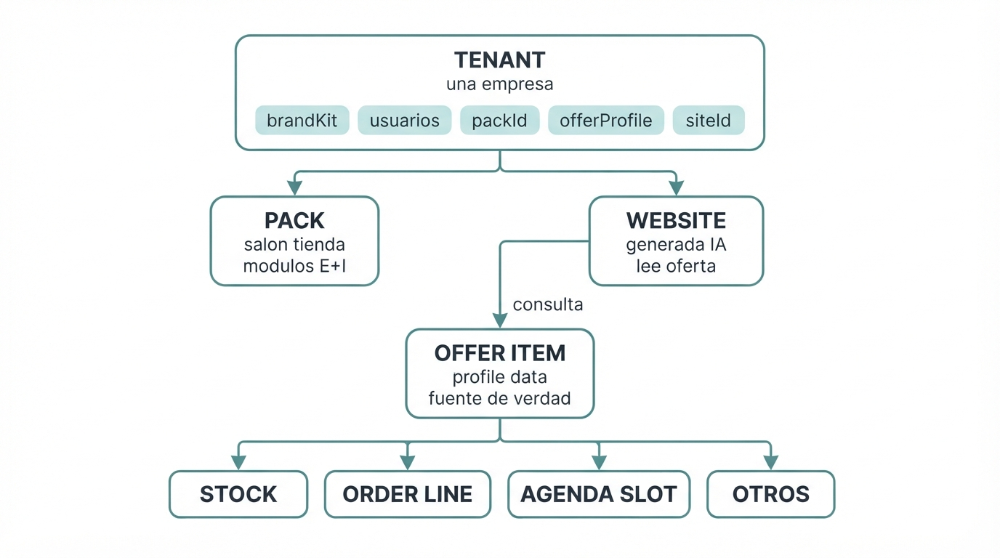
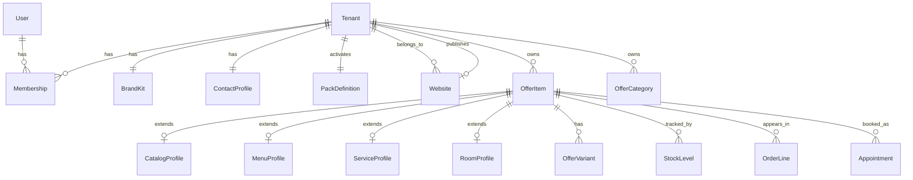

# Wavys OS — Modelo de dominio (núcleo)

**Documento de arquitectura de dominio**  
**Fecha:** 2026-07-21  
**Para:** Phil / Wavys  
**Depende de:** [mapa-negocios-y-nucleo.md](./mapa-negocios-y-nucleo.md)  
**Estado:** borrador de dominio (sin schemas SQL / sin código aún)

---

## 1. Para qué sirve este documento

Traducir el mapa de producto a **qué existe en el sistema**: entidades, relaciones y reglas.

No define aún: tablas exactas, Next vs Astro por archivo, ni pricing.  
Sí define: **Tenant, Pack, Oferta tipada, Website, y cómo los módulos tocan la oferta**.

---

## 2. Mapa mental del dominio



*Archivo:* `data/wavys-os-brief/assets/mapa-mental-dominio.jpg` (Gemini `gemini-3.1-flash-lite-image`)

**Regla madre:** todo dato de negocio lleva `tenantId`. La web pública y el panel operan sobre el mismo tenant. La website **consulta** la oferta; no es dueña del catálogo.

---

## 3. Bounded contexts (límites)

| Contexto | Responsabilidad | Entidades núcleo |
|----------|-----------------|------------------|
| **Identity & Tenant** | Quién es la empresa, usuarios, pack activo | Tenant, User, Membership, BrandKit, ContactProfile |
| **Pack & Modules** | Qué capacidades E+I están encendidas | PackDefinition, TenantModuleFlag |
| **Offer (Oferta)** | Qué se vende (tipado) | OfferItem, OfferCategory, OfferVariant, OfferProfile* |
| **Presence (Website)** | Cara pública generada por IA | Website, WebsiteDeployment, WebsiteSectionConfig |
| **Inventory** | Cantidades | StockLevel, StockMovement |
| **Scheduling** | Tiempo + recurso | Resource, TimeSlot / Appointment / Reservation |
| **Commerce** | Pedidos / cotizaciones | Order, OrderLine, Quote |
| **CRM ligero** | Leads, clientes, acuerdos | Lead, Customer, Deal / Agreement |
| **Ops** | Órdenes internas | WorkOrder (+ estados) |
| **Money** | Señas / pagos simples | Payment, Deposit |
| **Team** | Roles operativos | StaffMember, Assignment |

Los contextos hablan entre sí por IDs (ej. `OrderLine.offerItemId`), no mezclando tablas “de todo” en un solo cajón conceptual.

---

## 4. Tenant + Pack + Brand

### 4.1 Tenant

Representa **una empresa** en la plataforma.

| Campo conceptual | Descripción |
|------------------|-------------|
| `id` | Identificador único |
| `name` | Nombre comercial |
| `slug` | Subdominio / path (`miga.wavys.app`) |
| `packId` | Pack activo (salón, tienda, …) |
| `offerProfile` | Tipo de oferta dominante: `catalog` \| `menu` \| `service` \| `room` |
| `status` | `onboarding` \| `active` \| `suspended` |
| `timezone` | Ej. `America/Lima` |
| `contact` | *(preferir entidad `ContactProfile`)* resumen o FK |

Un tenant = un isolation boundary de datos. Usuarios de un tenant no ven otro.

### 4.2 PackDefinition (catálogo de producto Wavys)

Definición estática (configuración, no fila por cliente):

| Campo | Descripción |
|-------|-------------|
| `id` | `salon` \| `clinic` \| `restaurant` \| `shop` \| `hotel` \| `pro` \| `workshop` \| `b2b` |
| `label` | Nombre visible |
| `offerProfile` | Perfil de oferta por defecto |
| `modules` | Lista de módulos con prioridad E/I incluidos en el pack |
| `vocabulary` | Labels UI (`servicio` vs `producto` vs `plato`) |
| `websiteSkill` | `one_call_landing` y/o `one_call_website` según tipo de site |

Al crear el tenant se **copia/activa** el set de módulos E+I del pack (flags en el tenant).

### 4.3 BrandKit (crítico — de aquí sale la web)

**BrandKit es la fuente de verdad de la marca y del brief de negocio** que consume el skill al generar/editar la website.  
Si BrandKit está vacío o mal, la web sale genérica o inventa datos. **Tiene que funcionar bien.**

#### Qué es vs qué no es

| Entidad | Contiene | No contiene |
|---------|----------|-------------|
| **BrandKit** | Identidad visual + voz + brief + assets de marca | WhatsApp/dirección (eso es ContactProfile) |
| **ContactProfile** | Cómo contactarte | Logo/colores |
| **OfferItem** | Qué vendes | Marca |
| **Website.themeSnapshot** | Copia del tema **aplicado** en el último generate (auditoría) | No reemplaza BrandKit |

```text
BrandKit + ContactProfile + Pack + Offer
        │
        ▼
 generate_website (modelo potente)
        │
        ▼
 Website (HTML/CSS)  ←── lee binding oferta/contacto en vivo
```

#### Campos BrandKit (DB)

| Campo | Oblig. onboarding | Descripción |
|-------|-------------------|-------------|
| `tenantId` | sí | |
| `displayName` | sí | Nombre de marca (puede = businessName) |
| `tagline` | rec. | Frase corta bajo el logo |
| `shortBio` | sí | 1–3 frases: qué es el negocio (alimenta hero/about) |
| `industryNotes` | no | Matices del rubro |
| `logoUrl` | no* | Logo principal (PNG/SVG). *Si no hay, web con wordmark |
| `logoDarkUrl` | no | Variante para fondos claros |
| `faviconUrl` | no | |
| `primaryColor` | sí** | Hex. **O “auto_from_pack” si elige que la IA proponga |
| `secondaryColor` | no | |
| `accentColor` | no | |
| `backgroundTone` | no | `light` \| `dark` \| `warm` \| `cool` |
| `fontHeading` | no | Preferencia o “auto” |
| `fontBody` | no | |
| `voiceTone` | sí | Ej. cálido, premium, juvenil, serio |
| `voiceDo` | no | Palabras/estilo a usar |
| `voiceDont` | no | Evitar (slang, inglés forzado…) |
| `ctaPreference` | rec. | “WhatsApp” / “Pedir cita” / “Ver catálogo” |
| `imageStyle` | no | Guía para Gemini (ej. “fotos de producto fondo claro”) |
| `galleryAssetIds` | no | Fotos de local/equipo/producto propias |
| `referenceUrls` | no | Links de inspiración (opcional) |
| `completeness` | auto | `draft` \| `min_ready` \| `rich` |
| `updatedAt` | | |

**`min_ready` (gate antes de generate_website):**  
`displayName` + `shortBio` + `voiceTone` + (`primaryColor` o auto) + ContactProfile.whatsapp.

#### Reglas de producto

1. Chat onboarding **no salta** BrandKit: pide bio + tono + color (o auto).  
2. `generate_website` **lee BrandKit**; no inventa nombre/colores si ya existen.  
3. Editar marca por chat (“cambia el color a verde”) → update BrandKit → luego `edit_website` o regen parcial.  
4. Regenerar web **full** reutiliza BrandKit actualizado (no pide todo de nuevo).  
5. Assets: guardar URLs en storage del tenant; no embeber binarios en el prompt sin límite.  
6. Marketing creativo (add-on) **reutiliza** el mismo BrandKit (misma cara de marca).

#### Completitud y UX

| Estado | Sidebar / chat | Efecto |
|--------|----------------|--------|
| `draft` | “Completa tu marca” | Bloquea generate o avisa fuerte |
| `min_ready` | OK para 1ª web | Generate permitido |
| `rich` | Logo + fotos + voz fina | Mejores regeneraciones / marketing |

### 4.4 ContactProfile (sección contacto de la web)

**Sí lo estamos modelando así:** el contacto **no vive solo en el HTML**.  
Es data del tenant; la website la **muestra** (como la oferta).

| Campo | Descripción | Uso en web |
|-------|-------------|------------|
| `tenantId` | Dueño | |
| `businessName` | Nombre público | Header / contacto |
| `phone` | Teléfono | Click-to-call |
| `whatsapp` | Número WhatsApp (E.164) | CTA principal PYME |
| `whatsappMessage` | Texto precargado | “Hola, vi su web…” |
| `email` | Correo público | mailto / form |
| `addressLine` | Dirección | Bloque contacto |
| `city` / `region` / `country` | Ubicación | SEO / mapa |
| `mapsUrl` | Link Google Maps | Botón mapa |
| `lat` / `lng` | Opcional | Mapa embebido |
| `hours` | JSON horarios (lun–dom) | “Horario de atención” |
| `socialLinks` | IG, FB, TikTok, LinkedIn | Iconos |
| `formEnabled` | Si el form de la web está on | |
| `formNotifyEmail` | A dónde llegan avisos | |
| `updatedAt` | | |

**Relación website ↔ contacto:**

```text
Website (diseño IA)
   └── sección Contacto / CTA
            │ lee
            ▼
     ContactProfile (DB)
            │
            ├── WhatsApp / teléfono / mail / mapa  → enlaces vivos
            └── Formulario “Escríbenos”            → crea Lead (crm_leads)
```

**Reglas:**

1. Al generar la web, el skill **inyecta** datos de `ContactProfile` (no inventa WhatsApp falso).  
2. Si el dueño cambia WhatsApp en el chat (“actualiza mi WhatsApp al …”), se actualiza la **DB** → la web se actualiza sola (binding), sin regenerar todo el site.  
3. El formulario de contacto → `Lead` con `source=website_contact`.  
4. Si falta un dato en onboarding, el chat lo pide antes o deja placeholder editable.  
5. Multi-sede (después): varios `ContactProfile` o `ContactLocation[]`; v1 = un perfil por tenant.

### 4.5 User / Membership

| Entidad | Rol |
|---------|-----|
| `User` | Identidad de login |
| `Membership` | `userId` + `tenantId` + `role` (`owner` \| `admin` \| `staff` \| `readonly`) |

---

## 5. Oferta tipada (corazón del dominio)

### 5.1 Idea

Un **OfferItem** es la unidad vendible.  
Todos comparten un **núcleo común**.  
Los campos especiales viven en un **perfil** según tipo (no 4 tablas sin relación).

```text
OfferItem (común)
   ├── profile = catalog   → CatalogProfile (+ variants)
   ├── profile = menu      → MenuProfile
   ├── profile = service   → ServiceProfile
   └── profile = room      → RoomProfile
```

### 5.2 OfferItem (núcleo común)

| Campo | Descripción |
|-------|-------------|
| `id` | ID |
| `tenantId` | Dueño |
| `profile` | `catalog` \| `menu` \| `service` \| `room` |
| `name` | Nombre público |
| `description` | Texto corto |
| `categoryId` | Categoría (opcional) |
| `basePrice` | Precio base (decimal) |
| `currency` | Ej. `PEN` |
| `images` | Lista de URLs |
| `isActive` | Visible en panel |
| `isPublic` | Visible en website |
| `sortOrder` | Orden en listados |
| `createdAt` / `updatedAt` | Auditoría |

**Regla web:** la website solo lista items con `isPublic && isActive`.

### 5.3 OfferCategory

Árbol simple por tenant: “Entradas”, “Cortes”, “Habitaciones dobles”, etc.

### 5.4 Perfiles

#### CatalogProfile (tienda / B2B)

| Campo | Para qué |
|-------|----------|
| `sku` | Código interno |
| `barcode` | Opcional |
| `trackStock` | Si mueve inventario |
| `attributes` | JSON libre controlado (material, marca…) |
| variantes | Ver `OfferVariant` |

**OfferVariant** (talla/color/etc.):

| Campo | Descripción |
|-------|-------------|
| `offerItemId` | Padre |
| `sku` | SKU variante |
| `options` | `{ "talla": "M", "color": "Negro" }` |
| `priceOverride` | Null = usa `basePrice` |
| `trackStock` | Por variante |

Catálogos masivos = muchos `OfferItem` + variantes; la web pagina desde API, no embebe todo en build estático.

#### MenuProfile (resto / pastelería)

| Campo | Para qué |
|-------|----------|
| `isSoldOut` | Agotado en carta |
| `portion` | Porción / tamaño |
| `allergens` | Lista |
| `prepMinutes` | Opcional |
| `availableSchedule` | Horarios de plato (opcional) |

Stock de insumos puede ser aparte; `isSoldOut` es flag de carta (rápido para la web).

#### ServiceProfile (salón / clínica / pro / taller)

| Campo | Para qué |
|-------|----------|
| `durationMinutes` | Duración |
| `bufferMinutes` | Holgura entre citas |
| `resourceMode` | `any` \| `specific_staff` |
| `defaultStaffIds` | Quiénes lo ofrecen |
| `packageSessions` | Si es paquete (n sesiones) |

La **Agenda** agenda slots ligados a `offerItemId` (el servicio).

#### RoomProfile (hotel)

| Campo | Para qué |
|-------|----------|
| `capacity` | Personas |
| `bedConfig` | Texto / enum |
| `amenities` | Lista |
| `rateUnit` | `night` (v1) |
| `inventoryCount` | Cuántas habitaciones de ese tipo |

Reservas usan Agenda con unidad = noche + `offerItemId` (tipo de habitación).

### 5.5 Qué pack usa qué perfil

| Pack | `offerProfile` por defecto | Notas |
|------|----------------------------|-------|
| Tienda / B2B | `catalog` | Variantes + stock |
| Resto | `menu` | + stock insumos (módulo) |
| Salón / Clínica / Pro / Taller | `service` | + agenda |
| Hotel | `room` | + reservas por noche |
| Salón (retail) | `service` + items `catalog` opcionales | Dos perfiles en el mismo tenant permitidos |

**Regla:** un tenant tiene un perfil *dominante*, pero puede tener items de otro perfil si el pack lo permite (ej. salón vende shampoo = `catalog`).

---

## 6. Website (presencia) y su relación con la oferta

### 6.1 Website

| Campo | Descripción |
|-------|-------------|
| `id` | ID |
| `tenantId` | 1:1 o 1:N suave (v1 = un site primario) |
| `moldId` | Molde 1–5 del runtime B |
| `status` | `draft` \| `generating` \| `preview` \| `published` \| `failed` |
| `primaryDomain` | Dominio custom (después; MVP null) |
| `defaultHost` | `{slug}.wavys.app` |
| `siteConfig` | JSON layout/copy del runtime B (no el catálogo) |
| `themeSnapshot` | Auditoría del tema aplicado; BrandKit manda |
| `offerBinding` | Cómo consume la oferta (ver abajo) |

### 6.2 OfferBinding (contrato web ↔ catálogo)

La website **no posee** los productos. Tiene un binding:

| Campo | Descripción |
|-------|-------------|
| `mode` | `live_api` (preferido) \| `build_time_snapshot` (solo seed/fallback) |
| `publicOfferFilter` | Ej. `isPublic=true`, categorías incluidas |
| `listPagePath` | `/menu`, `/catalogo`, `/servicios` |
| `detailPagePattern` | `/catalogo/[slug]` |

**Reglas:**

1. Generación IA = estructura, copy de marca, secciones, estilo.  
2. Listados de oferta = fetch al API del tenant (o ISR/SSR que lea DB).  
3. Cambiar precio en panel → visible en web sin volver a “regenerar el site” completo.  
4. Regenerar el site (skill) **no borra** OfferItems.

### 6.3 Flujo de creación

```text
1. Signup → Tenant + Pack + BrandKit
2. Prompt onboarding → detecta pack / offerProfile
3. Skill IA genera Website (caja)
4. Seed opcional de OfferItems desde el prompt (pocos)
5. Website.offerBinding apunta al API de oferta del tenant
6. Dueño carga/importa catálogo masivo en panel
7. Web muestra lo público; módulos usan los mismos IDs
```

---

## 7. Módulos que tocan la oferta (vínculos)

Solo el **enlace de dominio**; el detalle fino de cada módulo viene después.

### 7.1 Inventory

- `StockLevel(tenantId, offerItemId | variantId, quantity, lowStockThreshold)`  
- `StockMovement(... delta, reason, refType, refId)`  
- Aplica si `trackStock` / perfil catalog (y repuestos, etc.).  
- Menú puede usar `isSoldOut` sin movimiento, o stock de insumos aparte (fase posterior).

### 7.2 Commerce (Order / Quote)

- `Order` / `Quote` pertenecen al tenant.  
- `OrderLine(offerItemId, variantId?, qty, unitPrice, nameSnapshot)`  
- `nameSnapshot` + precio al momento del pedido (historial estable si el item cambia después).

### 7.3 Scheduling

- `Resource` = staff, box, mesa, habitación física.  
- `Appointment` o `Reservation`: `offerItemId`, `resourceId`, `startsAt`, `endsAt`, `customerId?`, `status`.  
- Servicio → duración desde `ServiceProfile`.  
- Habitación → noches desde `RoomProfile`.

### 7.4 CRM

- `Lead` puede nacer desde la web (form) con `source=website`.  
- `Customer` tiene historial de orders / appointments.  
- `Agreement` (acuerdos) puede referenciar `offerItemIds` cotizados, pero no es un catálogo.

### 7.5 Ops (WorkOrder)

- Taller: OT ligada a `customerId` + líneas de servicio/repuestos (`offerItemId`).  
- Resto cocina: estados de `Order`, no necesariamente OT separada en v1.

### 7.6 Money

- `Payment` / `Deposit` referencian `orderId` \| `appointmentId` \| `reservationId`.

### 7.7 Team

- `StaffMember` puede estar en `ServiceProfile.defaultStaffIds` y en `Resource`.

---

## 8. Diagrama de relaciones ( Mermaid )



---

## 9. Invariantes (reglas que no se rompen)

1. **Todo** registro de negocio tiene `tenantId` válido.  
2. Un `OfferItem.profile` determina qué perfil hijo existe (uno).  
3. La website **no** es dueña del catálogo; solo lo muestra vía binding.  
4. Regenerar website **no** destruye oferta ni pedidos.  
5. Pack define módulos E+I; el tenant no inventa módulos fuera del catálogo Wavys sin flag.  
6. Cita (Scheduling) ≠ Acuerdo (CRM Agreement).  
7. Precios en líneas de pedido se **snapshottean**; el `basePrice` del item puede cambiar después.  
8. Catálogo masivo se resuelve con API + paginación, no con HTML estático gigante.

---

## 10. Glosario rápido

| Término | Significado |
|---------|-------------|
| Tenant | Empresa cliente de Wavys OS |
| Pack | Plantilla vertical (salón, tienda…) con módulos E+I |
| OfferItem | Unidad vendible en la base |
| OfferProfile | Familia de atributos (catalog/menu/service/room) |
| Website | Site generado por skill IA, ligado al tenant |
| OfferBinding | Contrato de cómo la web lee la oferta |
| Module | Capacidad de software (stock, agenda, …) activable |

---

## 11. Qué queda fuera de este doc (siguiente)

| Siguiente doc / paso | Contenido |
|----------------------|-----------|
| Orden de packs | Qué vertical se implementa primero en código |
| Flujos críticos | Happy path del pack piloto (pantalla a pantalla) |
| API de oferta pública | Endpoints que consume la website |
| Arquitectura técnica | Next panel, Astro/Next site, Vercel tenants, DB |
| Schemas SQL / Prisma | Traducción física de este dominio |

---

## 12. Resumen

- **Tenant** aísla la empresa y activa un **Pack**.  
- **Oferta tipada** es la fuente de verdad de lo que se vende.  
- **Website** la diseña la IA y **se relaciona** con la oferta por binding/API.  
- **Módulos** (stock, pedidos, agenda…) referencian los mismos `OfferItem`.  

Eso es el esqueleto sobre el que se construye el sistema.

---

*Ubicación:* `data/wavys-os-brief/modelo-dominio-nucleo.md`
