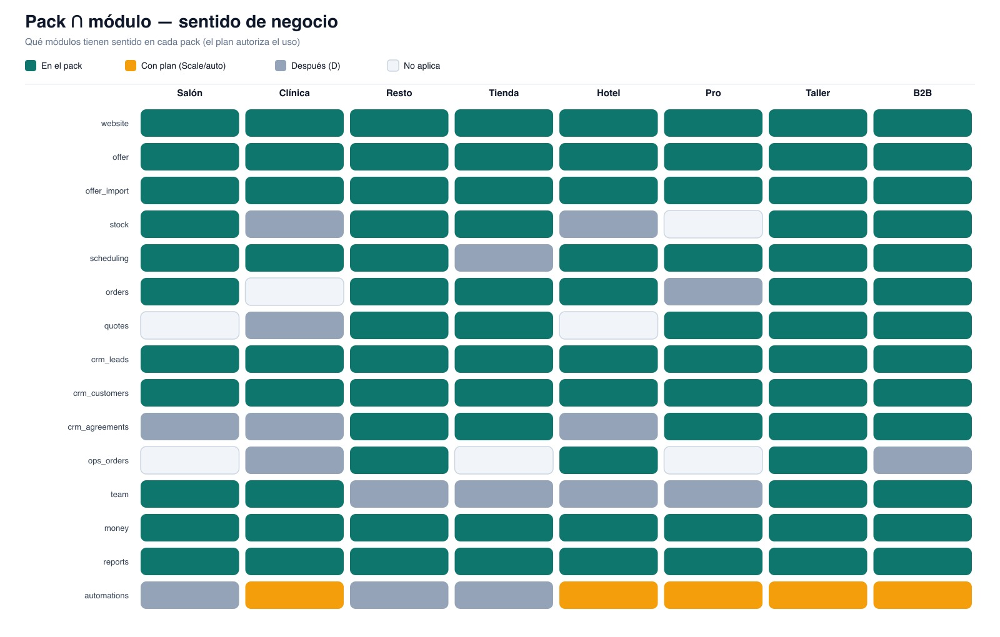

# Wavys OS — Planes, entitlements y chat (cómo funciona)

**Documento de producto / reglas de acceso**  
**Fecha:** 2026-07-21  
**Para:** Phil / Wavys  
**Depende de:**  
- [mapa-negocios-y-nucleo.md](./mapa-negocios-y-nucleo.md)  
- [modelo-dominio-nucleo.md](./modelo-dominio-nucleo.md)  

**Estado:** reglas de funcionamiento (precios en soles = placeholder / por definir)

---

## 1. En una frase

El usuario habla con el **chat**. El chat solo puede **mostrar y ejecutar** lo que el **pack** (tipo de negocio) + el **plan** (suscripción) permiten. La DB guarda tenant, oferta, web y flags; el chat es el panel de mando.

---

## 2. Tres conceptos que no se mezclan

| Concepto | Qué es | Ejemplo |
|----------|--------|---------|
| **Pack** | Vertical / tipo de negocio | Tienda, Salón, Resto |
| **Plan** | Suscripción comercial (qué paga) | Presence, Operate, Scale |
| **Módulo** | Herramienta predefinida del sistema | `website`, `offer`, `stock`, `scheduling` |

```text
Pack  →  qué módulos TIENEN SENTIDO para ese negocio
Plan  →  qué módulos / límites PUEDE USAR (pagó)
Chat  →  ejecuta solo si Pack ∩ Plan lo permiten
```

**Ejemplo:**  
- Pack Salón incluye `scheduling` (citas).  
- Si el plan es solo Presence (web), el chat **explica** citas pero **no las activa** hasta upgrade.  
- Pack Tienda + plan Operate → chat puede activar `stock` e importar Excel.

---

## 3. Cómo funciona todo (flujo maestro)

```text
Usuario ──chat──► Agente Wavys OS
                      │
                      ├─ 1. Identifica tenant + rol
                      ├─ 2. Lee pack + plan + entitlements
                      ├─ 3. Elige tool (o responde guía)
                      ├─ 4. Chequea canExecute(tool)
                      │       ├─ no  → explica plan / upsell
                      │       └─ sí  → ejecuta (DB / skill web / import)
                      └─ 5. Confirma resultado en el chat
```

**Regla de oro del chat:** nunca ejecuta una tool fuera de entitlements. Puede *hablar* de lo que existe en el producto, pero solo *hace* lo permitido.

---

## 4. Catálogo de módulos (herramientas del sistema)

IDs estables (para DB + chat tools):

| `moduleId` | Nombre | Qué hace |
|------------|--------|----------|
| `website` | Website | Crear / editar / publicar site (skill IA) |
| `offer` | Oferta | Catálogo / menú / servicios / habitaciones (DB) |
| `offer_import` | Importación | Excel/CSV → oferta |
| `stock` | Inventario | Stock + movimientos + alertas |
| `scheduling` | Agenda | Citas / reservas |
| `orders` | Pedidos | Encargos / pedidos + estados |
| `quotes` | Cotizaciones | Cotización → pedido |
| `crm_leads` | Leads | Bandeja + estados |
| `crm_customers` | Clientes | Fichas |
| `crm_agreements` | Acuerdos | Reuniones de acuerdo / pipeline |
| `ops_orders` | Órdenes ops | OT / cocina / housekeeping |
| `team` | Equipo | Staff, roles, asignación |
| `money` | Dinero | Señas, pagos simples, caja |
| `reports` | Reportes | Reportes simples |
| `automations` | Automatización | Recordatorios / WhatsApp (fase posterior) |
| `marketing` | Marketing creativo | Flyers, posts, video — **add-on / Scale+** (sube precio) |

Cada pack declara cuáles de estos son **E+I** (ver mapa). El plan declara cuáles están **incluidos** y con qué **límites**.

**Detalle de submódulos:** [catalogo-modulos-submodulos.md](./catalogo-modulos-submodulos.md).

---

## 5. Pack ∩ módulo (sentido de negocio)

Resumen: el pack **habilita candidatos**; el plan **autoriza uso**.



*Archivo:* `data/wavys-os-brief/assets/pack-modulo-matriz.jpg`  
*(SVG editable: `assets/pack-modulo-matriz.svg`)*

| Módulo | Salón | Clínica | Resto | Tienda | Hotel | Pro | Taller | B2B |
|--------|-------|---------|-------|--------|-------|-----|--------|-----|
| website | ✓ | ✓ | ✓ | ✓ | ✓ | ✓ | ✓ | ✓ |
| offer | ✓ servicio | ✓ servicio | ✓ menú | ✓ catálogo | ✓ room | ✓ servicio | ✓ servicio | ✓ catálogo |
| offer_import | ✓ | ✓ | ✓ | ✓ | ✓ | ✓ | ✓ | ✓ |
| stock | ✓ retail | —/D | ✓ | ✓ | —/D | — | ✓ | ✓ |
| scheduling | ✓ citas | ✓ citas | ✓ mesa | —/D | ✓ noches | ✓ consulta | ✓ recepción | visitas* |
| orders | ✓ | — | ✓ | ✓ | reserva* | —/D | ✓ | ✓ |
| quotes | — | —/D | ✓ | ✓ | — | ✓ | ✓ | ✓ |
| crm_leads | ✓ | ✓ | ✓ | ✓ | ✓ | ✓ | ✓ | ✓ |
| crm_customers | ✓ | ✓ | ✓ | ✓ | ✓ | ✓ | ✓ | ✓ |
| crm_agreements | —/D | —/D | ✓ catering | ✓ mayorista | —/D | ✓ | ✓ flotas | ✓ |
| ops_orders | — | —/D | ✓ cocina | — | ✓ housekeep | — | ✓ OT | —/D |
| team | ✓ | ✓ | —/D | —/D | —/D | —/D | ✓ | ✓ |
| money | ✓ | ✓ | ✓ | ✓ | ✓ | ✓ | ✓ | ✓ |
| reports | ✓ | ✓ | ✓ | ✓ | ✓ | ✓ | ✓ | ✓ |
| automations | D | I→plan | D | D | I→plan | I→plan | I→plan | I→plan |

\*visitas B2B = scheduling ligero de visitas, no “cita de salón”.  
\*reserva hotel puede modelarse como `orders` + `scheduling`.

Si el usuario pide un módulo **fuera del pack**, el chat dice: *“Eso no encaja con un [salón]; ¿quieres cambiar de pack o usar X?”*

---

## 6. Planes (entitlements comerciales)

> **Precios en S/:** ver marco en [costos-creditos-precios.md](./costos-creditos-precios.md) (suscripción + créditos IA). Montos finales = Phil confirma.

### 6.1 Tres planes (propuesta de arquitectura)

| Plan | Promesa | Incluye (módulos) | Límites orientativos (v1) |
|------|---------|-------------------|---------------------------|
| **Presence** | Verse online y mostrar oferta | `website`, `offer`, `offer_import` (cupo bajo), `crm_leads` | 1 site, N items oferta (ej. 50), 1–2 usuarios, ediciones web/mes limitadas |
| **Operate** | Operar el día a día | Todo Presence + módulos E+I del pack (stock, scheduling, orders, customers, money, reports, team según pack) | Items oferta alto (ej. 2 000), usuarios 5, imports Excel, dominio custom |
| **Scale** | Crecer / automatizar | Todo Operate + `automations` (+ `marketing` si Scale incluye creativo), límites altos | Items ilimitados prácticos, usuarios 15+, prioridad generación web |

**Add-on `marketing`:** se puede vender encima de Operate o Scale (+S/79–149). Detalle: [catalogo-modulos-submodulos.md](./catalogo-modulos-submodulos.md) § 3.15 · precios en [costos-creditos-precios.md](./costos-creditos-precios.md).

### 6.2 Entitlement (fila en DB)

Por tenant:

| Campo | Descripción |
|-------|-------------|
| `planId` | `presence` \| `operate` \| `scale` |
| `status` | `trial` \| `active` \| `past_due` \| `canceled` |
| `modulesAllowed` | Lista de `moduleId` (o se deriva del plan + pack) |
| `limits` | JSON: `maxOfferItems`, `maxUsers`, `maxWebRegensPerMonth`, `maxImportsPerMonth` |
| `periodStart` / `periodEnd` | Ciclo de facturación |

**Cálculo efectivo:**

```text
modulesEffective = modulesInPack(packId) ∩ modulesInPlan(planId)
canUse(module)   = module ∈ modulesEffective && underLimits(...)
```

### 6.3 Reglas de upgrade (chat)

1. Usuario pide algo no incluido → chat explica beneficio + CTA upgrade.  
2. No activa el módulo en silencio.  
3. Tras upgrade (o Phil lo marca en admin), el chat confirma: *“Stock ya está activo; ¿subimos el Excel?”*

---

## 7. Tools del chat (contrato de ejecución)

Cada tool es una acción que el agente puede invocar.  
Antes: `assertCan(tenant, toolId)`.

### 7.1 Tools v1 (núcleo)

| `toolId` | Requiere módulo | Qué ejecuta |
|----------|-----------------|-------------|
| `list_capabilities` | — (siempre) | Lista módulos efectivos + límites + “cómo usarlo” |
| `explain_plan` | — | Qué incluye el plan vs qué falta |
| `set_pack` / `detect_pack` | onboarding | Asigna pack desde prompt |
| `generate_website` | `website` | Skill `one_call_landing` / `one_call_website` |
| `edit_website` | `website` | Cambio puntual o regeneración parcial |
| `publish_website` | `website` | Publicar / dominio |
| `offer_create` / `offer_update` | `offer` | CRUD item |
| `offer_import_excel` | `offer_import` | Parse Excel → OfferItems |
| `offer_list` | `offer` | Consultar catálogo (también para la web) |
| `module_enable` | plan + pack | Enciende flag de módulo permitido |
| `stock_adjust` | `stock` | Movimiento de inventario |
| `stock_status` | `stock` | Consulta / alertas |
| `scheduling_book` | `scheduling` | Crear cita/reserva |
| `order_create` | `orders` | Crear pedido |
| `lead_capture` | `crm_leads` | Alta lead (web o chat) |
| `customer_upsert` | `crm_customers` | Ficha cliente |
| `agreement_note` | `crm_agreements` | Nota de acuerdo |
| `report_summary` | `reports` | Resumen simple |

### 7.2 Comportamiento del chat

| Intención del usuario | Respuesta del agente |
|-----------------------|----------------------|
| “¿Qué puedo hacer?” | `list_capabilities` |
| “Arma mi web…” | `detect_pack` → `generate_website` (+ seed oferta opcional) |
| “Edita el hero…” | `edit_website` |
| “Subo este Excel” | `offer_import_excel` (valida límites) |
| “Activa stock” | Si Operate+pack: `module_enable(stock)`; si no: `explain_plan` |
| “¿Cuánto me queda del plan?” | `explain_plan` + límites usados |

### 7.3 Pseudocódigo de permiso

```text
function canExecute(tenant, toolId):
  tool = TOOLS[toolId]
  if tool.moduleId is null: return allow
  if tool.moduleId not in effectiveModules(tenant): return deny("plan_or_pack")
  if exceedsLimit(tenant, tool): return deny("limit")
  if membership.role not in tool.roles: return deny("role")
  return allow
```

---

## 8. Qué va en la DB (vista para este doc)

Además del [modelo de dominio](./modelo-dominio-nucleo.md), para planes/chat:

| Entidad | Campos clave |
|---------|----------------|
| `PlanDefinition` | id, modules[], defaultLimits |
| `TenantSubscription` | tenantId, planId, status, limitsOverride?, period |
| `TenantModuleFlag` | tenantId, moduleId, enabledAt, enabledBy (`chat`\|`admin`) |
| `UsageCounter` | tenantId, key (`offer_items`, `web_regens`, `imports`), period, count |
| `ChatToolAudit` | tenantId, userId, toolId, ok/deny, reason, at |

La **oferta** y **website** ya están en el dominio; aquí solo se añade la capa de **quién puede qué**.

---

## 9. Relación con Presencia Digital (hoy)

| Hoy (servicio) | Mañana (Wavys OS) |
|----------------|-------------------|
| Wavys entrega la web a mano | Chat → `generate_website` |
| Planes S/149–199 presencia | Plan **Presence** (precios a alinear después) |
| Tienda = más alcance | Plan **Operate** + pack Tienda (`offer` + `stock` + `orders`) |
| Soporte humano | Chat ejecuta + humano en edge cases |

Migración: cliente Presencia Digital → tenant con plan Presence + website ya publicada + oferta vacía o seed.

---

## 10. Flujos felices (mini)

### A. Alta Presence (cualquier pack)

1. Chat: describe negocio → `detect_pack`  
2. `generate_website`  
3. Seed 5–10 `OfferItem` o “sube Excel después”  
4. `publish_website`  
5. Chat: “Tu plan Presence incluye web + oferta. Stock/citas están en Operate.”

### B. Operate + Excel (Tienda)

1. Upgrade a Operate (o ya lo tiene)  
2. `module_enable(stock)` si aplica  
3. `offer_import_excel`  
4. Web ya lista items públicos vía binding  
5. `stock_adjust` / alertas

### C. Salón + citas

1. Pack salón + Operate  
2. Oferta tipo `service`  
3. `scheduling_book`  
4. Web muestra servicios desde DB; agenda no es HTML estático

---

## 11. Decisiones tomadas

1. Chat-first = panel de mando.  
2. Pack ≠ Plan.  
3. Módulos predefinidos; chat activa/ejecuta, no inventa ERP.  
4. Website IA + oferta DB + binding.  
5. Tres planes: Presence / Operate / Scale (nombres ajustables).  
6. Precios S/ después de cerrar límites reales.

---

## 12. Qué sigue

1. Elegir **pack piloto** + plan mínimo (Presence → Operate).  
2. Bajar `PlanDefinition` + `TenantSubscription` a schema SQL/Prisma.  
3. Implementar primeras tools: `list_capabilities`, `generate_website`, `offer_import_excel`, `module_enable`.  
4. Arquitectura técnica (API + Vercel).  

---

*Ubicación:* `data/wavys-os-brief/planes-entitlements-chat.md`
