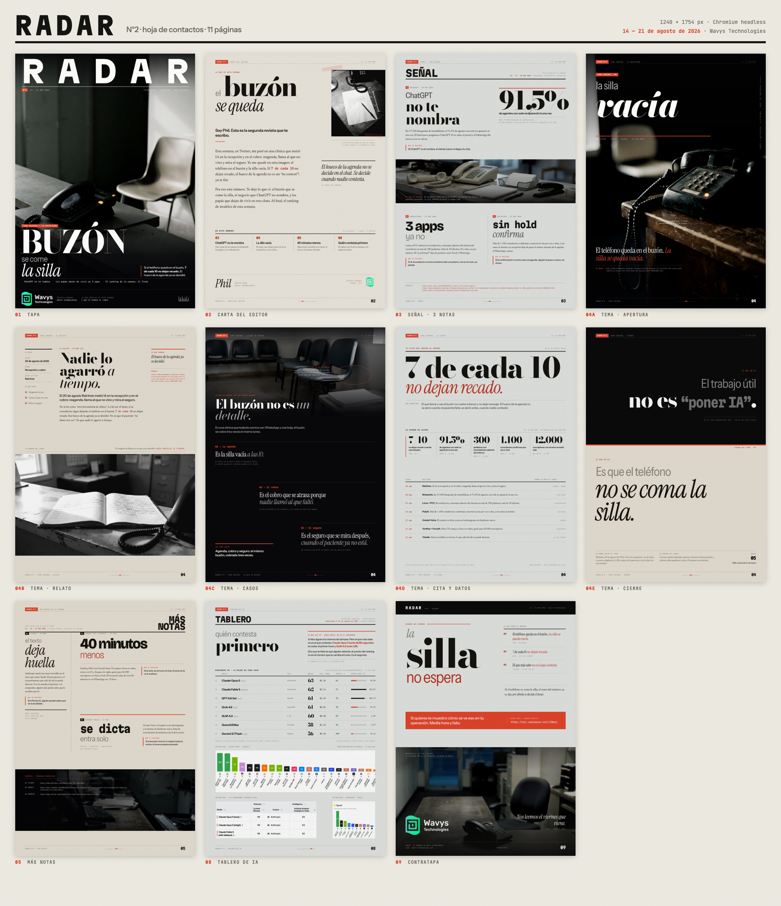

# RADAR N°2 · el buzón se come la silla

Semanal de Wavys Technologies · **14 — 21 de agosto de 2026**

Once páginas de 1240 × 1754 px hechas en HTML y CSS y exportadas a PNG con
Chromium headless. El tema del número es Raintree: si el teléfono queda en el
buzón, el hueco de la agenda ya se decidió.



## Mapa del número

| # | Archivo | Sección | Material | Grilla y voz |
|---|---|---|---|---|
| 01 | `01-tapa.html` | Tapa | Foto a sangre | La recepción ocupa el campo y el tipo se sienta sobre el mostrador de esa misma foto, no sobre un velo. Masthead mono a sangre para que RADAR pegue a un metro. Cascada **BUZÓN / se come / la silla**. |
| 02 | `02-carta-del-editor.html` | Carta del editor | Papel | Papel de carta: cascada arriba a la izquierda, recorte sangrando por el canto derecho, una sola mancha de lectura de medida corta y el sumario del número al pie. Firma Phil · agosto 2026. |
| 03 | `03-senal.html` | Señal · 3 notas | Papel frío | Mosaico de front-of-book: nota A grande con su cifra ancla (91,5 %), banda de foto a sangre por los dos cantos y abajo dos notas en columnas desiguales. Una voz tipográfica por nota. |
| 04a | `04a-tema-central-apertura.html` | Tema · apertura | Tinta | El objeto es el sujeto. El tipo abraza al teléfono en dos anclas: cascada **la silla / vacía** arriba y la frase de apertura abajo. El objeto queda libre en el medio. |
| 04b | `04b-tema-central-relato.html` | Tema · relato | Papel | Tres tiempos verticales: riel de datos a la izquierda, una mancha de lectura al centro, riel de fuentes a la derecha, y la foto entra como banda impresa al pie. |
| 04c | `04c-tema-central-casos.html` | Tema · lo que se decide | Tinta | Escalera: la foto entra como banda alta cortada por el titular y debajo tres tramos bajan en diagonal, cada uno colgado de su filete. |
| 04d | `04d-tema-central-cita-datos.html` | Tema · la cifra | Papel frío | Bandas horizontales de distinta altura, sin foto: la cita **7 de cada 10 / no dejan recado** en el tercio alto, la semana en cifras en una fila de cinco y la línea de tiempo en mono al pie. |
| 04e | `04e-tema-central-reglas.html` | Tema · cierre | Dos tintas | Type-is-layout: la página se parte en dos materiales. Arriba en tinta lo que el trabajo **no es** (“poner IA”), abajo en papel lo que **sí es** (que el teléfono no se coma la silla). |
| 05 | `05-mas-noticias.html` | Más notas | Papel | Tres módulos desiguales, al revés de la 03: cabeza a la derecha, columna angosta a todo lo alto por la izquierda y dos módulos apilados en alturas distintas. Claude · OneKey · Overjet. |
| 08 | `08-tablero-ia.html` | Tablero de IA | Papel frío | Infoporn: tabla tipografiada con los números reales de Artificial Analysis, más tres capturas del sitio recortadas por CSS. Titular **quién contesta / primero**. |
| 09 | `09-contratapa.html` | Contratapa | Papel + foto a sangre | Espejo invertido de la tapa: el papel manda arriba, la foto entra por el pie hasta el borde. Cascada **la silla / no espera**, CTA y la marca sobre la silla vacía. |

No hay páginas 06 ni 07 en este número.

## Sistema

Lo compartido vive en `css/radar.css`; la personalidad de cada sección vive en
el `<style>` de su propio HTML. Página de 1240 × 1754 con margen de 68 px y una
grilla de 12 columnas de 88 px con gutter de 8 dentro de 1104 px.

### Material y tinta

| Rol | Valor |
|---|---|
| Tinta del número | `#0b0b0c` (negro neutro, no cálido) |
| Papel de diario | `#e7e1d4` · papel frío `#e3e5e2` |
| Acento del número | bermellón `#e2452b` / profundo `#b8301c` |
| Verde de marca | `#01fd91`, **solo** dentro del logo oficial, nunca como tinta |

### Voces

Siete familias, todas self-hosted en `fonts/` (41 archivos woff2, ninguna
petición de red en el export). Ninguna se repite del N°1.

| Variable | Familia | Para qué |
|---|---|---|
| `--mast` | Martian Mono | masthead RADAR, etiquetas, folios |
| `--display` | Bodoni Moda | la palabra 70 de cada cascada |
| `--grot` | Instrument Sans | decks, *why it matters*, cifras |
| `--read` | Newsreader | cuerpo de lectura |
| `--serif` | Instrument Serif | pull quotes y firma |
| `--wide` | Bricolage Grotesque | voz de la página 05 |
| `--mono` | JetBrains Mono | dato, fecha, URL |

Para volver a bajarlas: `bash radar-n2/scripts/fetch-fonts.sh`

## Cómo se exporta

```bash
# las 11 páginas a export/*.png (1240×1754, DPR 1) + diagnóstico de maquetación
node radar-n2/scripts/dev-shot.mjs

# una sola página
node radar-n2/scripts/dev-shot.mjs 04d-tema-central-cita-datos.html

# hoja de contactos → radar-n2/contact-sheet.png
node radar-n2/scripts/contact-sheet.mjs
```

`dev-shot.mjs` maneja el Chromium headless por CDP y además avisa hasta dónde
llega el contenido, qué se sale de la caja y qué cajas de texto se pisan entre
sí. Ese aviso es el que hay que dejar en `ok` antes de dar una página por
cerrada.

`export-page.sh` hace lo mismo llamando al binario de Chrome a mano
(`--headless=new --window-size=1240,1754 --screenshot`), igual que el N°1. Es
más lento porque Chrome no siempre cierra solo después de escribir el PNG.

## Imágenes y datos

- **Escenas** — ocho fotos en `img/`, generadas con `gemini-3.1-flash-lite-image`.
  Motivo único del número: recepción · teléfono de escritorio · UNA silla vacía.
  Cero cara, cero cyborg, cero interfaz legible, cero café. Prompts y reglas en
  [`SCENES.md`](SCENES.md), script en `scripts/gen-scenes.mjs`.
- **Gráficos** — todo lo de la página 08 se capturó de Artificial Analysis el 21
  de agosto de 2026 con Chromium headless. Los recortes se hacen por CSS, nunca
  reescribiendo el PNG. Procedencia número por número en
  [`charts/SOURCES.md`](charts/SOURCES.md), script en
  `scripts/capture-aa-charts.mjs`. Ningún ranking se inventó.
- **Logo** — los PNG oficiales de `logo/` se colocan tal cual. El logo no se
  redibuja, no se recolorea y no se reconstruye en CSS.

## Estructura

```
radar-n2/
├── 01-tapa.html … 09-contratapa.html   11 páginas
├── css/radar.css                       sistema compartido
├── fonts/                              41 woff2 + fonts.css
├── img/                                8 escenas
├── charts/                             capturas AA + leaderboard.json + SOURCES.md
├── logo/                               PNG oficiales de Wavys
├── export/                             11 PNG de 1240×1754
├── contact-sheet.png                   hoja de contactos del número
├── scripts/                            fetch-fonts · gen-scenes · capture-aa · dev-shot · contact-sheet
├── export-page.sh                      export con el binario de Chrome
├── BUILD.md                            especificación del número
├── SCENES.md                           prompts y reglas de foto
└── README.md
```

## Qué cambió respecto del N°1

| | N°1 | N°2 |
|---|---|---|
| Material dominante | tinta casi siempre | papel de diario |
| Acento | teal | bermellón |
| Voces | Archivo · Fraunces · Playfair · Spectral · Zilla Slab · IBM Plex Mono | Martian Mono · Bodoni Moda · Instrument Sans · Newsreader · Instrument Serif · Bricolage Grotesque · JetBrains Mono |
| Cabeza de página | — | spine con tab macizo arriba, folio grande abajo a la derecha |
| Motivo de foto | cara y retrato | recepción, teléfono, silla vacía. Cero cara |
| Tema | — | Raintree: el buzón se come la silla |
